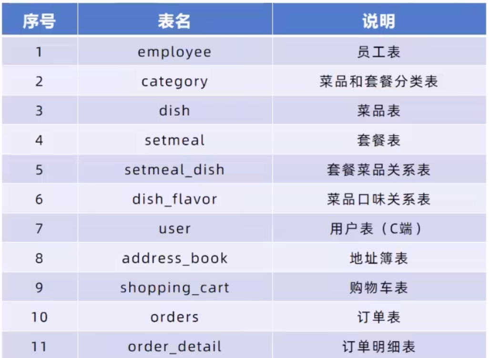

# 项目介绍
本项目是专门为餐饮企业(餐厅、饭店)等服务的软件产品，包括系统管理后台和移动端应用两个部分。其中系统管理后台主要提供给餐饮企业内部员工使用，可以对餐厅的菜品、套餐、订单等进行管理维护。移动端应用主要提供给消费者使用，可以在线浏览菜品、添加购物车、下单等。

# 技术选型
## 网关层：
- ngix
## 应用层
- SpringBoot
- SpringMVC
- SpringCache
- Spring
- Swagger
- MyBatis-Plus
## 数据层
- MySql
- Redis
## 工具
- git
- maven
# 具体功能
## 移动端前台
- 手机号登录
- 地址管理
- 菜品浏览
- 购物车
- 下单
## 管理系统后台
- 用户登录、退出
- 用户管理
- 菜品管理
- 套餐管理
- 分类管理
- 菜品口味管理

# 数据库表设计

# 项目难点
- 为提高客户端用户登录和菜品管理速度，采用Redis对相关数据进行缓存
- 使用读写分离架构提高MySQl数据库读写效率和安全性

# 项目部署
1. 使用[sql文件](mysql/reggie.sql)构建数据库
2. 项目的代码为[serverCode](serverCode)文件，修改[配置文件](serverCode/src/main/resources/application.yml)文件中的mysql、redis、文件根目录配置
3. 启动项目